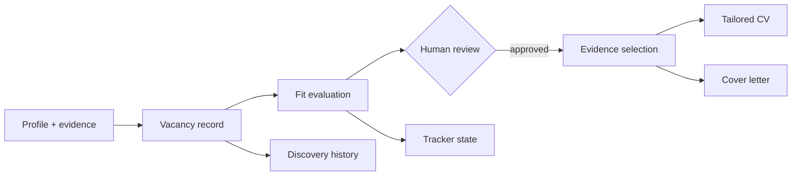

# Evidence-Led Job Search System

This folder is the public portfolio edition of a private, file-based job-search workflow. It demonstrates how prompt-driven research assistance can be made traceable, conservative, and reviewable without publishing personal data or live application history.

All candidate, vacancy, employer, and application content in this folder is synthetic.

## What it demonstrates

- A source-of-truth profile and evidence library.
- Normalized vacancy records with explicit uncertainty.
- Requirement-by-requirement fit evaluation.
- Evidence selection before drafting application materials.
- Vacancy-specific CV and cover-letter workflows with claim boundaries.
- Human approval gates before external actions.
- Plain-file persistence that remains inspectable in Git and VS Code.

## Architecture



The system separates facts from decisions:

- `sample-data/profile.yaml` and `sample-data/evidence.md` are evidence inputs.
- `sample-data/emails/` contains synthetic Gmail-like inputs for a digest and a single-posting alert.
- `sample-data/vacancy.md` is the normalized job input.
- `examples/extraction-output.json` records the synthetic extraction result.
- `examples/fit-evaluation.md` records the comparison and recommendation.
- `examples/evidence-selection.md` records what may be used downstream.
- `examples/tailored-cv.md` is a derived artifact, not a new source of truth.
- `examples/cover-letter.md` demonstrates contextual drafting after evidence selection.

## Folder map

| Path | Purpose |
|---|---|
| `skills/` | Public prompt/workflow specifications for the core stages |
| `sample-data/` | Synthetic inputs suitable for demonstrations |
| `examples/` | Synthetic downstream outputs |
| `templates/` | Minimal reusable file contracts |
| `WALKTHROUGH.md` | End-to-end synthetic demonstration |
| `ARCHITECTURE.md` | State model, controls, and design decisions |
| `PRIVACY.md` | Publication and redaction policy |
| `jobsearch_demo/` | Dependency-free local parser, pipeline, privacy scanner, and connector boundary |
| `run_demo.py` | Local command-line entry point |
| `tests/` | Standard-library unit tests |

## Deliberate scope

This portfolio edition is a reviewable design and synthetic demonstration, not a live connector package. The private system uses account-specific job-alert sources through Claude; those integrations, credentials, real vacancies, personal contact details, and historical tracker rows are intentionally absent here. The email fixtures and extraction JSON show the intended boundary without claiming a production parser.

## Run the local demo

The code uses only the Python standard library. From the repository root:

```powershell
python run_demo.py --input sample-data/emails --output demo-output
python -m unittest discover -s tests -v
```

The demo writes `extraction-output.json`, `discovered.md`, `tracker.csv`, and `privacy-report.json` to the selected output directory. It does not connect to Gmail, call Indeed, send messages, or submit applications.

## Claude connector boundary

`jobsearch_demo/connector.py` defines the small interface the private Claude-connected workflow would need: `search_threads()` for Gmail-like threads and `search_jobs()` for Indeed-like results. `FixtureClaudeConnector` implements the same shape with local synthetic fixtures only. It performs no network access and contains no credentials.

## Design principles

1. Evidence before prose.
2. Missing evidence is reported, not silently filled.
3. Transferable capability is separated from direct sector experience.
4. Recommendations are gated by administrative blockers and essential requirements.
5. Drafting never implies submission.
6. Every generated artifact has a clear owner and overwrite rule.
