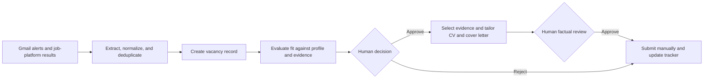

# Evidence-Led Job Search System

A human-controlled workflow for discovering vacancies, evaluating fit,
selecting verified evidence, and producing tailored application materials.

The system connects job-alert discovery, structured vacancy records,
requirement-level evaluation, tracking, and CV and cover-letter drafting while
keeping all decisions and external actions under human control.

## Problem

A serious job search creates several connected problems:

- vacancies arrive through different platforms and email alerts;
- the same vacancy may appear more than once;
- requirements must be compared with evidence from several past roles and
  projects;
- application materials must be tailored without exaggerating experience;
- decisions, deadlines, and application status must remain traceable.

When these tasks are handled separately, information is easily lost. It also
becomes difficult to distinguish direct experience from transferable skills or
to verify that every statement in a tailored CV is supported by evidence.

Generative AI can accelerate vacancy evaluation and drafting, but it can also
produce unsupported claims, overstate partial matches, or make application
decisions without sufficient human review.

## Approach

This project uses an evidence-first workflow.

A structured profile and evidence library act as the source of truth. Each
vacancy is converted into a normalized record and evaluated requirement by
requirement before any application material is drafted.

The workflow separates:

1. vacancy discovery and extraction;
2. deduplication and tracking;
3. administrative and eligibility checks;
4. requirement-level fit evaluation;
5. human approval or rejection;
6. evidence selection;
7. tailored CV and cover-letter drafting;
8. final factual review and manual submission.

Missing evidence is reported rather than filled in. Direct experience is kept
separate from transferable capability, and a recommendation to apply never
counts as approval or submission.

## Private and public versions

The private workflow is manually invoked through Claude and uses connected
Gmail job-alert emails and job platforms as discovery sources.

The public repository is a portfolio-safe implementation. It replaces real
vacancies, candidate information, email identifiers, and application materials
with synthetic fixtures. It demonstrates the workflow, file contracts, local
pipeline, tests, and privacy controls without publishing credentials or
personal application data.

## My contribution

I designed the evidence model, vacancy-record structure, requirement-level
evaluation process, human approval gates, tracking logic, and application
tailoring workflow.

I also defined the rules separating verified, partially verified, transferable,
and unsupported claims. Claude Code assisted with implementation and execution,
while the workflow architecture, evidence rules, evaluation criteria, and
quality-control decisions were developed and reviewed by me.
## How it works

1. When manually invoked, Claude searches connected Gmail job-alert emails and job platforms for new vacancies.
2. Relevant vacancies are extracted and converted into structured records.
3. Duplicate vacancies are identified and the tracker is updated.
4. Each vacancy is evaluated against the candidate profile and evidence library.
5. Suitable vacancies are presented for human review.
6. After approval, the system selects supporting evidence and drafts a tailored CV and cover letter.
7. The human reviews all claims and submits the application manually.

In the private workflow, Gmail and job-platform access is provided through account-specific Claude connections. The public repository uses synthetic fixtures and contains no credentials or live application data.

## What it demonstrates

- A source-of-truth profile and evidence library.
- Normalized vacancy records with explicit uncertainty.
- Requirement-by-requirement fit evaluation.
- Evidence selection before drafting application materials.
- Vacancy-specific CV and cover-letter workflows with explicit claim boundaries.
- Human approval gates before external actions.
- Plain-file persistence that remains inspectable in Git and VS Code.

## Architecture


## Folder map

| Path | Purpose |
|---|---|
| `skills/` | Public prompt/workflow specifications for the core stages |
| `sample-data/` | Synthetic inputs suitable for demonstrations |
| `examples/` | Synthetic downstream outputs |
| `templates/` | Minimal reusable file contracts |
| `WALKTHROUGH.md` | End-to-end synthetic demonstration |
| `ARCHITECTURE.md` | State model, controls, and design decisions |
| `PRIVACY.md` | Publication and redaction policy |
| `jobsearch_demo/` | Dependency-free local parser, pipeline, privacy scanner, and connector boundary |
| `run_demo.py` | Local command-line entry point |
| `tests/` | Standard-library unit tests |

## Deliberate scope

This portfolio edition is a reviewable design and synthetic demonstration, not a live connector package. The private system uses account-specific job-alert sources through Claude; those integrations, credentials, real vacancies, personal contact details, and historical tracker rows are intentionally absent here. The email fixtures and extraction JSON show the intended boundary without claiming a production parser.

## Run the local demo

The code uses only the Python standard library. From the repository root:

```powershell
python run_demo.py --input sample-data/emails --output demo-output
python -m unittest discover -s tests -v
```

The demo writes `extraction-output.json`, `discovered.md`, `tracker.csv`, and `privacy-report.json` to the selected output directory. It does not connect to Gmail, call Indeed, send messages, or submit applications.

## Claude connector boundary

`jobsearch_demo/connector.py` defines the small interface the private Claude-connected workflow would need: `search_threads()` for Gmail-like threads and `search_jobs()` for Indeed-like results. `FixtureClaudeConnector` implements the same shape with local synthetic fixtures only. It performs no network access and contains no credentials.

## Design principles

1. Evidence before prose.
2. Missing evidence is reported, not silently filled.
3. Transferable capability is separated from direct sector experience.
4. Recommendations are gated by administrative blockers and essential requirements.
5. Drafting never implies submission.
6. Every generated artifact has a clear owner and overwrite rule.
